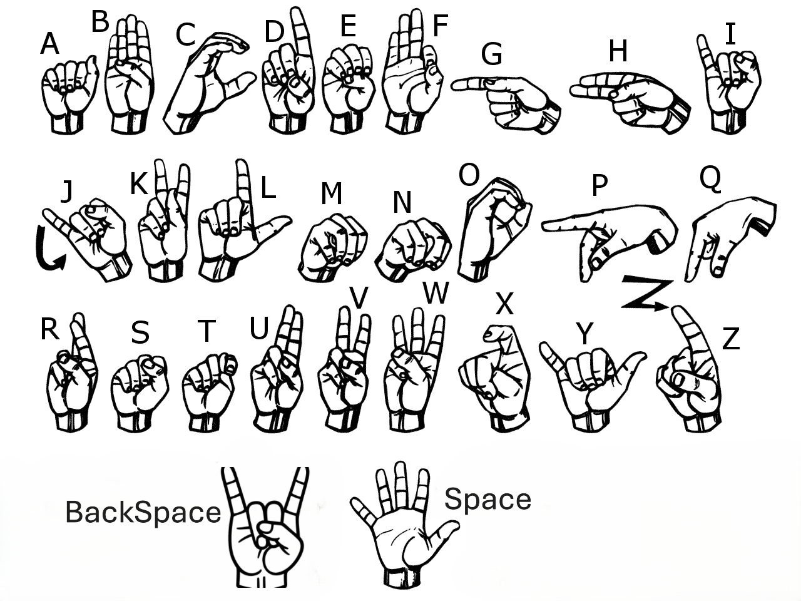

<p align="center">
  
</p>

# SignSpeak: Real-Time Hand Gesture Recognition and Translation Framework 🤟

SignSpeak is a computer vision and machine learning platform designed to facilitate seamless communication between sign language users and non-signers. By utilizing a lightweight WebRTC/HTTP frame-streaming architecture, SignSpeak extracts hand landmarks using MediaPipe, classifies gestures via a trained Random Forest model, constructs complete word/character strings in real time, and translates the generated sentences into multiple target languages.

---

## 📌 Abstract & Architectural Overview

The core objective of SignSpeak is to bridge the communication gap for American Sign Language (ASL) by offering real-time gesture decoding with minimal computational overhead. 

Rather than processing heavy raw video streams through deep 3D-CNNs (which impose high latency and GPU dependencies), the framework utilizes a multi-stage pipeline:
1. **Geometric Feature Extraction**: Captures 21 3D hand landmarks per frame using MediaPipe Hands.
2. **Relative Spatial Normalization**: Normalizes coordinate point vectors relative to the hand's minimum bounding box to achieve scale and position invariance.
3. **Random Forest Classification**: Maps standardized 42-element vector representations (`x`, `y` offsets) to 28 discrete gesture classes (`A-Z`, `Space`, `Backspace`).
4. **Temporal Sentence Assembly**: Uses a time-buffered session tracker to convert continuous gesture holds into finalized string inputs.
5. **Multilingual Translation Engine**: Translates assembled text into chosen target languages using RPC translation endpoints.

```text
                  +-------------------------------------------------+
                  |                 Client Web App                  |
                  |     (Webcam Stream / HTML5 / JavaScript)        |
                  +------------------------+------------------------+
                                           |
                                HTTP POST /process_frame
                                           |
                                           v
+-----------------------------------------------------------------------------------+
| FastAPI Server Infrastructure                                                     |
|                                                                                   |
|  +--------------------+    +---------------------+    +------------------------+  |
|  | Frame Preprocess   | -> | MediaPipe Engine    | -> | Coordinate Vectorizer  |  |
|  | (OpenCV / Decoding)|    | (Landmark Extract)  |    | (Min-Max Offset Norm)  |  |
|  +--------------------+    +---------------------+    +------------------------+  |
|                                                                   |               |
|  +--------------------+    +---------------------+                v               |
|  | Session Manager    | <- | Random Forest Model | <------------------------------+  |
|  | (Temporal Buffers) |    | (Classification)    |                                 |
|  +---------+----------+    +---------------------+                                 |
|            |                                                                      |
+------------|----------------------------------------------------------------------+
             |
             +---> Finalized Text String ---> HTTP POST /translate ---> Translated Output

cat << 'EOF'
🔬 System Methodology & Pipeline

1. Feature Engineering & Normalization
For every captured image frame F ∈ ℝ^(H × W × 3):
- The hand tracking module detects 21 key landmarks, where each landmark i consists of normalized image coordinates (x_i, y_i).
- To make prediction invariant to hand location within the webcam frame, coordinate translation normalization is applied:

    x_i' = x_i - min_j(x_j),    y_i' = y_i - min_j(y_j)

- The normalized values are flattened into a 1D feature vector V ∈ ℝ^42:

    V = [x_0', y_0', x_1', y_1', ..., x_20', y_20']

2. Temporal Gesture Persistence Logic
To distinguish intentional sign selections from transitory hand movement:
- A session buffer monitors continuous detection of a predicted character C.
- Hold Threshold: A character C is appended to the active sentence array only after maintaining a steady gesture state for ≥ 2.0 seconds.
- Control Sequences:
  - 'Bk' -> Triggers sentence.pop() (deletes last character).
  - ' '  -> Appends space character.
EOF
```
## 📂 Repository Structure
```
SignSpeak/
├── main.py                # FastAPI app entry point & frame processing API
├── requirements.txt       # Environment dependency definitions
├── README.md              # Project documentation
│
├── models/
│   └── model.p            # Trained Random Forest classifier binary
├── data/
│   └── dataset.pickle     # Vectorized landmark coordinates dataset
├── static/
│   ├── index.html         # User interface & video control interface
│   └── favicon.ico        # Static assets
│
└── src/                   # Pipeline execution scripts
    ├── collection_img.py  # Webcam dataset generation script
    ├── create_dataset.py  # MediaPipe landmark extraction batch runner
    └── model_train.py    # Random Forest classifier training script
```
## 🛠️ Tech Stack & Dependencies
```
Runtime Environment: Python 3.11.x

Web Framework: FastAPI, Uvicorn

Computer Vision: OpenCV (opencv-python), MediaPipe (mediapipe==0.10.14)

Machine Learning: Scikit-Learn (scikit-learn), NumPy

Translation: googletrans==4.0.0-rc1

Form Handling: python-multipart
```

---

## ⚡ Quick Start & Installation
```
1. Environment Setup
It is strongly recommended to run this project under Python 3.11:

# Clone the repository
git clone https://github.com/your-username/SignSpeak.git
cd SignSpeak

# Create a virtual environment
python -m venv .venv

# Activate virtual environment
# Windows (PowerShell):
.\.venv\Scripts\activate
# Linux / macOS:
# source .venv/bin/activate

# Install dependencies
pip install -r requirements.txt

2. Execute Application
Run the server directly from the project root:

uvicorn main:app --reload

Access the user interface at: [http://127.0.0.1:8000](http://127.0.0.1:8000)
```
---

## 🧪 Training & Custom Dataset Pipeline
```
If you want to train the model on new custom gesture classes or retrain on different lighting conditions:

Step 1: Image Collection
Collect 100 sample images per gesture class using your webcam:

python src/collection_img.py

Step 2: Extract Landmark Vectors
Extract normalized 42-element spatial vectors from the raw collected images:

python src/create_dataset.py
Output generated: data/dataset.pickle

Step 3: Model Training
Train a new Random Forest Classifier and evaluate test accuracy:

python src/model_train.py
Output generated: models/model.p

```
## 🌐 API Specification
```
1. POST /process_frame
Processes raw webcam frame submissions and updates session-based sign construction.

- Payload: multipart/form-data

  file: Binary image file (UploadFile)

  session_id: Unique identifier string (Form)

- Response:
  {
  "image": "<base64_encoded_frame_with_drawn_landmarks>",
  "sentence": "HELLO WORLD"
  }
  
2. POST /translate
Translates assembled text into target natural languages.

- Payload: application/json
  {
  "sentence": "RICE",
  "lang": "hindi"
  }

- Response:
  {
  "translated": "चावल"
  }
```
## 👨‍💻 Author
```
Aabhas Bhandari
```
